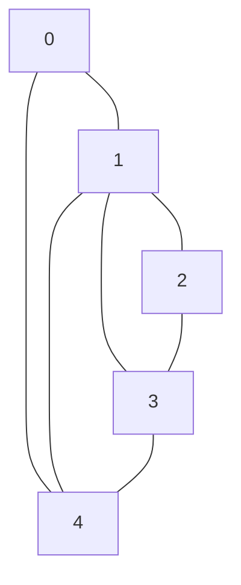
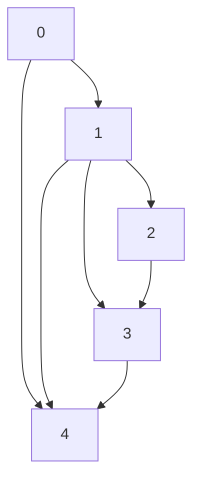

// Graph Representation 
// Adjacency List Representation
// MARK: Undirected Graph
```swift
struct Graph {
    let n: Int
    var adj: [[Int]]
    
    init(vertices n: Int) {
        self.n = n
        self.adj = Array(repeating: [], count: n)
    }
    
    mutating func addEdge(_ u: Int, _ v: Int) {
        guard u >= 0 && u < n && v >= 0 && v < n else { return }
        adj[u].append(v)
        adj[v].append(u) // For undirected graphs
    }
    
    func display() {
        for (vertex, neighbors) in adj.enumerated() {
            print("\(vertex): \(neighbors)")
        }
    }
}
var graph = Graph(vertices: 4)
graph.addEdge(0, 1)
graph.addEdge(0, 2)
graph.addEdge(1, 2)
graph.addEdge(2, 3)
graph.display()
// Expected Output:
// 0: [1, 2]
// 1: [0, 2]
// 2: [0, 1, 3]
// 3: [2]

// MARK: Directed Graph Version
struct DirectedGraph {
    let n: Int
    var adj: [[Int]]
    
    init(vertices n: Int) {
        self.n = n
        self.adj = Array(repeating: [], count: n)
    }
    
    mutating func addEdge(from u: Int, to v: Int) {
        guard u >= 0 && u < n && v >= 0 && v < n else { return }
        adj[u].append(v)
    }
    
    func display() {
        for (vertex, neighbors) in adj.enumerated() {
            print("\(vertex): \(neighbors)")
        }
    }
}
var dGraph = DirectedGraph(vertices: 3)
dGraph.addEdge(from: 0, to: 1)
dGraph.addEdge(from: 0, to: 2)
dGraph.addEdge(from: 1, to: 2)

dGraph.display()
// Expected Output:
// 0: [1, 2]
// 1: [2]
// 2: []
````
**Undirected Graph (from example)**

**Directed Graph (same edges but with direction)**

